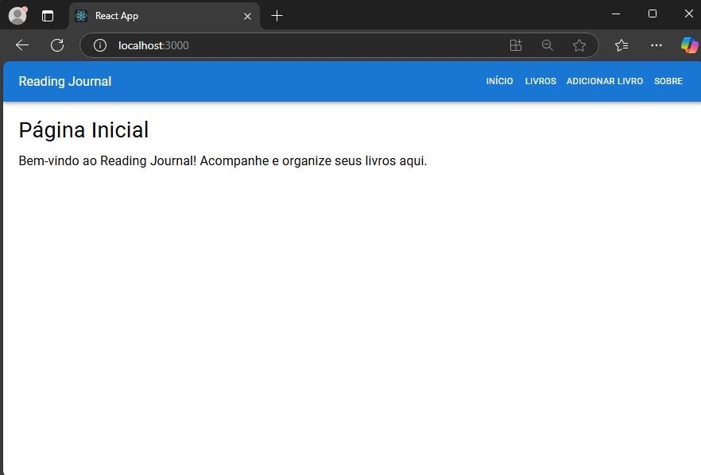
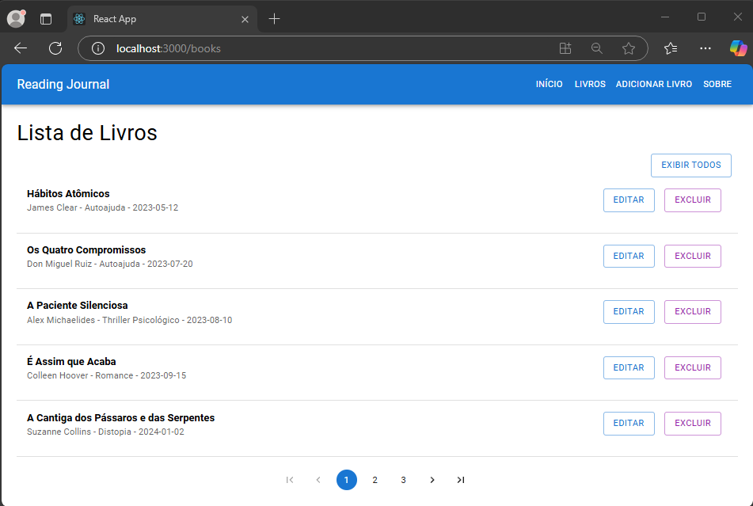
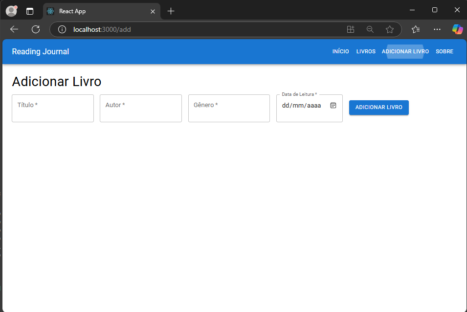
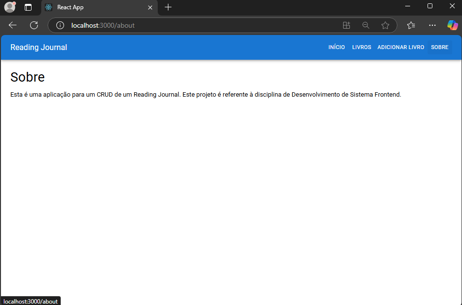

## Nome: `Hygor Olivio Lumertz`

## Como Rodar o Projeto

### 1. Descompactar o arquivo ZIP

Primeiro, extraia o conteúdo do arquivo ZIP que você recebeu para uma pasta de sua escolha.

### 2. Navegar até o diretório do projeto
No terminal, abra o diretório onde você descompactou o projeto:

```bash
cd caminho/para/o/diretorio
```

### 3. Instalar dependecias
Execute o seguinte comando para instalar as dependências necessárias do projeto:

```bash
npm install
```

### 4. Rodar o Projeto

Agora, você pode rodar o projeto localmente com o comando:

```bash
npm start
```

## Reading Journal - CRUD de Livros

Este é um projeto simples de um **Reading Journal**, onde os usuários podem adicionar, editar, excluir e listar livros, armazenando informações como título, autor, gênero e data de leitura.

## Funcionalidades

- **Listar Livros**: Exibe uma lista de livros cadastrados.
- **Adicionar Livro**: Permite ao usuário adicionar um novo livro à lista.
- **Editar Livro**: Permite editar os detalhes de um livro existente.
- **Excluir Livro**: Permite excluir um livro da lista.
- **Buscar Livros**: Filtro de busca por título e autor.

## Tecnologias Usadas

- **React**: Biblioteca para a construção da interface de usuário.
- **React Router**: Gerenciamento de navegação entre páginas da aplicação.
- **JavaScript (ES6+)**: Linguagem principal do projeto.
- **Hooks do React**: `useState`, `useEffect`, `useParams`, `useNavigate`.
- **@mui/material**: Framework de Ui uitlizado para estilização.
- **Cypress**: É uma ferramenta de teste de código aberto para aplicações web, focada principalmente em testes end-to-end (E2E).
- **Axios**: Axios é uma biblioteca JavaScript baseada em Promises para realizar requisições HTTP. É amplamente utilizada para interagir com APIs em projetos web, permitindo enviar e receber dados de forma simples e eficiente.

## Telas da Aplicação
- **Pagina inicial**

- **Lista dos livros**

- **Formulário de cadastro**

- **Sobre**

